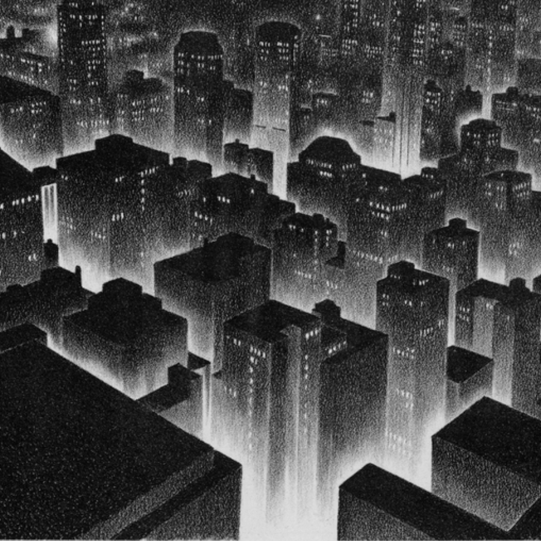

# MOTHNODE_ Circles

Rituals of the city, rituals of humans, repeating patterns, mantras.

**Listen now:** 

## Project Data

Description.

> **Title:** Cricles  / **Featuring:** MOTHNODE

> **Production:**  / **Lyrics:** 

> **Beat:** SYLER

> **Narrative Design:**

> **Music Video Credits:**


## Lyrics

```
get to the crib all wrong
get to the crib all wrong yeah

get to the crib all wrong
get to the crib all wrong yeah

(what's)
better the reason to draw all your circles
for wishes that won't be fulfilled
salt it out. sort it out
damn you father of rituals 

let's say
say you want this 
say you want it
then it's done

get to the crib all wrong <----- change this one?)
get to the crib all wrong yeah

(get to the crib all wrong
get to the crib all wrong yeah)

all the circles aren't paying off - ya ya
saying what you want through prayers
won't bring it back 
casting spell(s) for a price
it's naught for a reason (is a naught for a reason)
gotta pay it off with your soul ya ya

```

## Lore Notes

## Music Video

## Short Cinematic Film

## Miscellaneous Notes

[FREE] HARD DARK KAMAARA X AZRAEL GRIMWAVE TYPE BEAT | PROD. SYLER
